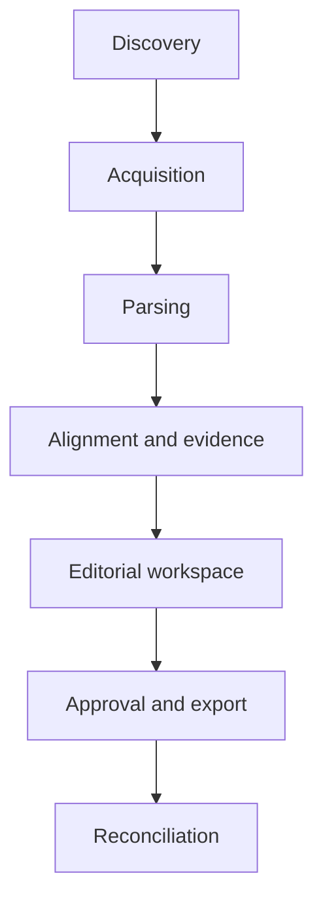

# Ajax Council Newsletter — First-release architecture

**Status:** Accepted by the product owner on 2026-09-07  
**Scope:** Private, single-product-owner workflow; design only

## Architectural intent

The system turns public Town of Ajax meeting sources into a reviewable newsletter draft without hiding uncertainty. Every published assertion must remain traceable to immutable retrieved bytes or an explicitly recorded observation. Staff recommendations, Council decisions, draft minutes, adopted minutes, automatic captions, and verified quotations are distinct facts throughout the workflow.

The first release is a local command-line application with SQLite metadata and an out-of-Git filesystem artifact store. Components communicate through persisted identifiers and explicit job states rather than an in-process chain that loses partial progress. Publication remains a human action outside the system.

## Trust and storage boundaries

| Boundary | Inside | Outside / rule |
|---|---|---|
| Git repository | Code, schemas, sanitized fixtures, deterministic tests, design docs | Never raw PDFs, videos, captions, transcripts, cookies, credentials, caches, private identifiers, or generated editions containing unpublished editorial work |
| Local application data | SQLite database, source artifacts, derived text, logs, drafts, exports | Must live under a configured data root outside the repository |
| Public sources | Ajax portal OData and document URLs; official YouTube evidence | Public does not mean correct or immutable; retrieved content is hashed and retained |
| Human authority | Match corrections, evidence verification, editorial approval, export authorization | Machine output cannot approve itself or silently replace observed values |

Credentials, if a later connector requires them, are supplied through environment variables or OS credential storage and never persisted in SQLite or logs. URLs are scrubbed before logging if they contain tokens. Files are written with owner-only permissions where supported. The application binds no network listener in the first release.

## Components and interfaces

The flow is resumable: each arrow passes durable IDs, never ephemeral objects alone.

1. **Meeting discovery** queries the public OData collection using Ajax-local date boundaries converted to UTC, explicit fields, pagination, retry/backoff, and a descriptive user agent. It writes immutable source snapshots and upserts logical meetings by source UUID or deterministic fallback identity. Raw and normalized values are both retained.
2. **Source acquisition** fetches bounded documents and caption resources. It streams bytes to a temporary file, calculates SHA-256, durably installs it in content-addressed storage, then records a version in the immutable `source_version` registry and its typed subtype. An existing digest target is fully rehashed before reuse. Changed bytes create a successor; they never overwrite prior evidence.
3. **Document and transcript parsing** produces versioned derived artifacts. A parser run declares its parser name/version, configuration hash, input hashes, and result state. PDF page text, link annotations, ASR tracks, and timestamped segments remain distinguishable. OCR is a later optional parser, not an implicit fallback.
4. **Meeting/agenda alignment** creates proposed links among meetings, streams, agenda items, document sections, and transcript intervals. Reviewed stream boundaries are immutable `meeting_stream_decision` records; corrections supersede with reviewer, time, reason, prior, and replacement values. One stream can cover several meetings, and one meeting can use several streams.
5. **Evidence extraction** writes immutable claim revisions and supporting or contradicting references to the immutable `source_version` registry. Typed locator rows resolve snapshots directly, documents through pages, transcripts through track/segments, and whole media through stream versions. Human review decisions append and supersede; claim text is never edited in place.
6. **Editorial workspace** assembles an edition from exact reviewed claim revision IDs. It preserves uncertainty labels and never promotes an ASR segment to a verified quotation without human verification against audio/video or an authoritative text.
7. **Approval and export** stores the exact edition revision approved, who approved it, when, and for what export target. Editing after approval creates a new revision requiring approval. Export creates a local artifact only; external publication is out of scope.
8. **Reconciliation** rechecks later adopted minutes or revised documents. It adds comparisons and correction proposals without modifying the historical edition or its evidence.

## Interface contracts

| Producer | Consumer | Durable contract |
|---|---|---|
| Discovery | Acquisition | `meeting_id`, `source_snapshot_id`, normalized source candidates, warnings |
| Acquisition | Parsing | immutable `source_version_id`, typed subtype ID, artifact hash, media type |
| Parsing | Alignment | parse-run ID, page/segment IDs, parser metadata, completeness state |
| Alignment | Evidence | reviewed/proposed link IDs, confidence, reasons, stream boundaries |
| Evidence | Editorial | exact claim revision ID, evidence IDs, additive review decision |
| Editorial | Approval/export | immutable edition revision ID and render hash |
| Reconciliation | Editorial review | comparison ID, changed source versions, affected claim IDs |

Components use repository/service interfaces around transactions and artifact reads. Connectors do not write editorial tables. Parsing does not decide document authority: draft/adopted status comes only from a superseding `document_authority_assessment` with reviewer, time, basis, reason, and evidence. Editorial code cannot mutate source observations.

## Job lifecycle, idempotency, and failure

Jobs use `pending -> running -> succeeded`, with `running -> retry_wait -> running`, `running -> needs_review`, or `running -> failed_terminal`. Lease expiry moves an interrupted `running` job back to `pending`, retaining its committed checkpoint. Cancellation is `pending|retry_wait|needs_review -> cancelled`; terminal and successful jobs never reopen.

Each job generation has a unique idempotency key over operation, explicit foreign-key target, immutable inputs, tool/config version, parameters, and generation number. Automatic transient retries append attempts inside the same generation. After `needs_review` or `failed_terminal`, an operator may create generation N+1 only with an auditable unique retry nonce and decision; repeating that request returns the same new job. Resume continues from committed item checkpoints. Retries never duplicate source versions, parse runs, decisions, claim revisions, or evidence.

Network timeouts, 429s, and most 5xx responses enter bounded `retry_wait`. Invalid formats and size limits enter `failed_terminal`; semantic conflicts enter `needs_review`. Operator correction produces a new generation rather than changing the terminal result. Partial batches commit each completed item independently.

State-changing human actions append audit events in the same database transaction. An override records actor, timestamp, reason, field/link affected, prior observed or effective value, replacement value, and supporting source references. Removing an override adds a reversal; it does not erase history.

## Source and evidence invariants

- A discovery rerun with the same source payload hash creates no duplicate snapshot. A changed payload creates a later snapshot tied to the same meeting.
- Blob identity is SHA-256 of exact bytes. A document version is immutable and unique by document plus content hash.
- Portal `modifiedon`, ETag, filename, and source field are observations, not proof of content version or authority.
- `draft`, `adopted`, `unknown`, and `disputed` exist only on immutable, superseding authority assessments; field placement alone cannot set `adopted`.
- A recommendation and a decision are separate claim types. A relationship may connect them, but one cannot be cast into the other.
- ASR text has `automatic_unverified` authority. A quotation requires a separate verification event and precise media reference.
- Availability uses `not_checked`, `available`, `unavailable`, `delayed`, `restricted`, and `error`; absence is not failure.
- Deletion defaults to logical withdrawal. Source artifacts and evidence used by an edition are retained; correction and supersession are additive.

## TASK-001 scenario walkthroughs

### A — Regular Council baseline

Discovery upserts the November 17 Council meeting and one snapshot. Agenda and minutes candidates become distinct documents; retrieved hashes create immutable versions. An additive authority assessment records any adopted conclusion. The direct video creates a stream and meeting-stream link with a separate boundary decision. ASR produces timestamped unverified segments. Evidence and edition membership name exact claim revisions. Reruns reuse identities; changed agenda bytes create a later version and flag dependent evidence for reconciliation.

### B — Alternate committee type

The CAP record uses the same pipeline while retaining its raw type and normalized committee type. Type is data, not a separate code path. Committee-specific agenda labels may be mapped by versioned normalization rules. Unknown labels remain reviewable instead of being forced into Council.

### C — Shared GGC/Council stream

One stream row for `BZAPz7ryBKE` has two meeting-stream relationships. Each has immutable reviewed boundary decisions. Transcript segments belong to the stream version; alignment maps intervals to the appropriate meeting and agenda items. Rerunning adds neither a second stream nor duplicate links. A boundary correction appends a superseding decision with reviewer/time/reason and prior/replacement values.

### D — Special Council with linked reports

The top-level package and each explicit report/attachment URL are separate documents related by package membership. Acquisition is bounded and non-recursive by policy; linked files require explicit jobs. Pages and linked documents can independently support claims. A later attachment replacement creates a new version, preserving the earlier hash and evidence.

### E — Wrong title and unavailable placeholder

The raw title, typed meeting, and scheduled date are preserved despite conflict. The placeholder stream is linked as an observation with `unavailable`; no transcript is fabricated. A match/classification review task records the conflict. Claims requiring discussion evidence remain unsupported or uncertain. Retry only occurs if the failure is transient; later availability creates a new stream observation/version.

### F — Blank video and misleading document fields

The blank portal field remains an observation. A reviewed official-channel match creates a stream link and additive match decision. Both same-named minutes files retain original fields; content review creates authority assessments rather than changing versions. Conflicts stay visible. A later corrected portal snapshot is additive and triggers reconciliation.

## Deterministic test and evaluation seams

- Connector contract tests use sanitized OData fixtures for pagination, timezone bounds, missing UUIDs, and schema drift.
- Repository tests use temporary SQLite and artifact directories to prove idempotent reruns, atomic writes, version creation, shared streams, rollback, and resumability.
- Parser golden tests pin fixture hashes, parser versions, page/segment locations, and malformed/mixed-PDF outcomes.
- Model invariant tests prevent authority promotion, destructive supersession, duplicate logical links, and approval of a mutable edition revision.
- Scenario evaluations encode A–F plus source revision. Expected records, states, warnings, review tasks, and evidence resolution are asserted without network access.
- Editorial evaluations measure unsupported-claim rate, evidence coverage, source-role confusion, and quotation verification; they never replace product-owner approval.

## Operational baseline

Use one process and SQLite transactions, with a filesystem lock preventing concurrent writers. Back up the database and artifact tree together after quiescing writes; verify hashes during restore drills. A manifest records database backup time and reachable artifact hashes. Retention is conservative: keep all source versions referenced by evidence, approvals, exports, or reconciliation. Unreferenced temporary downloads are removed after successful atomic ingest; policy-driven pruning is a future explicit assignment.

## Execution units and transaction boundaries

Discovery commits one source response page and its observations atomically.
Acquisition closes and flushes the temporary file, fully verifies any existing digest target, and otherwise atomically renames the new file.
Before metadata commit it durably syncs the final file and parent directory where the platform supports that guarantee.
On platforms without portable directory-sync semantics, ingest is deferred or uses a documented safe storage adapter; readability alone is insufficient.
An orphan sweep may register or quarantine a complete artifact left by a crash before metadata commit.
A parse run reads one immutable input version and writes one immutable result set.
Alignment commits proposals separately from reviewer decisions so model reruns cannot erase judgment.
Evidence extraction appends claim revisions and references; it does not update source text.
Edition assembly writes a new revision rather than modifying an approved revision.
Approval and its audit event share one transaction.
Export reads only the approved revision named by the request and records the output hash afterward.
Reconciliation creates findings and suggested actions without rewriting a prior export.

## Observability and recovery

Each job attempt records start/end time, outcome class, bounded diagnostic text, and correlation ID.
Logs identify records by internal ID and content hash, not by copying full source text.
Metrics are local aggregates: queue depth, attempt outcomes, artifact bytes, parse duration, and review backlog.
Health checks verify database integrity, writable data root, artifact reachability, and migration version.
A recovery run first verifies hashes, then requeues interrupted work from durable job states.
Missing referenced bytes are a data-integrity incident, never silently reacquired as if identical.
Reacquired bytes receive their own artifact identity and are compared with the missing reference.
Database backup without its artifact manifest is incomplete.
Artifact backup without the matching database checkpoint is useful but not a complete restore point.

## Performance posture

Expected first-release volume fits a single SQLite writer and concurrent read transactions.
WAL mode keeps review and export reads responsive while a short ingest transaction commits.
Expensive parsing runs outside database transactions and stages bounded results before commit.
Artifact reads stream from disk; large media is never loaded wholly into database rows.
Indexes follow access paths for job scheduling, source identity, edition evidence, and reconciliation.
Batch sizes are explicit and resumable so one malformed record cannot roll back an entire discovery period.

## Proposed next assignments

1. **TASK-003 — Persistence foundation:** implement the SQLite schema, migration discipline, content-addressed artifact store, audit events, and invariant tests only.
2. **TASK-004 — Production discovery/acquisition:** adapt the accepted prototype to the durable contracts with rate limits, caching, and A–F offline acceptance tests.
3. Later bounded tasks cover parsing, alignment/evidence, editorial assembly, reconciliation, and export. Each requires its own approval; none is authorized here.

## Decisions deferred

- Exact local data-root location and backup destination are product-owner configuration choices.
- Retention duration for unreferenced artifacts needs policy after storage measurements.
- OCR engine, YouTube enumeration method, transcript alignment model, UI, scheduling, hosting, authentication, and external publishing remain outside this design assignment.
